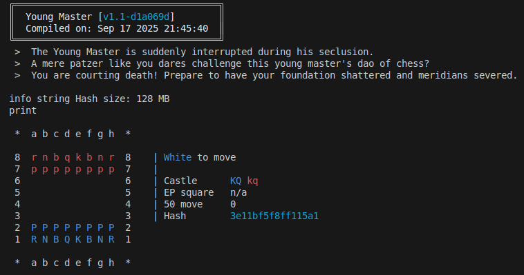

<h1 align="center">Young Master (少爷)</h1>

<p align="center">
  
  
  
  
</p>

<p align="center">
  <strong>Young Master is a UCI-compatible chess engine written in C.</strong>
</p>
<p align="center">
  <em>Do be careful though, he's a little arrogant!</em>
</p>

<p align="center">
    To use this engine you must install a UCI compatible GUI, like <a href="https://github.com/cutechess/cutechess">Cutechess</a> or <a href="http://www.playwitharena.de/">Arena</a>.
    
</p>

---

## Features

- **Pseudolegal move generation**
  - Magic bitboards
  - Okay-ish speed

- **Search**
  - Negamax principal variation search
  - Hash table cutoffs
  - Null move pruning
  - Reverse futility pruning
  - Late move reductions
  - Late move pruning
  - Internal iterative reductions
  - Mate distance pruning
  - Draw detection
  - Check extension
  - Quiescence search
  - Aspiration windows

- **Move ordering**
  - Hash move
  - MVV-LVA
  - Killer moves heuristic
  - History heuristic with malus

- **Evaluation (Manually tuned)**
  - Piece square tables and material
  - Mobility

---

## Installing (Linux only for now)

```bash
# Clone the repository
git clone https://github.com/SaintNong/young-master.git
cd young-master

# Build engine binary
make release

# Run the engine
bin/Young_Master
```
## Credits
Thank you to:
- The creators of [fastchess](https://github.com/Disservin/fastchess) and [cutechess](https://github.com/cutechess/cutechess), engine testing frameworks which were very helpful in testing if changes made were actually effective.
- Members of the Engine Programming discord server, namely shawn_xu, toanth, sscg13, and Twipply for massive help in finding very major flaws in my engine, and helping getting it working on Windows.
- The [VICE series](https://github.com/bluefeversoft/vice) by BlueFeverSoft for getting me into this hobby, and the general structure of how decently strong engines work.
- The contributors to the [Chess Programming Wiki](https://www.chessprogramming.org/Main_Page) for teaching me, and many others much about chess programming techniques 
- The creator and contributors of [publius](https://github.com/nescitus/publius), a modern didactic engine which includes the more recent chess programming advancements, helping me massively in understanding some stuff that isn't found on the CPW.
- The creators and contributors of the top chess engines [Ethereal](https://github.com/AndyGrant/Ethereal/), [Berserk](https://github.com/jhonnold/berserk/), and [Koivisto](https://github.com/Luecx/Koivisto/) for having very readable comments which explained cutting edge features to me.
- Pradu Kannan for the excellent magic bitboard implementation used in this project.